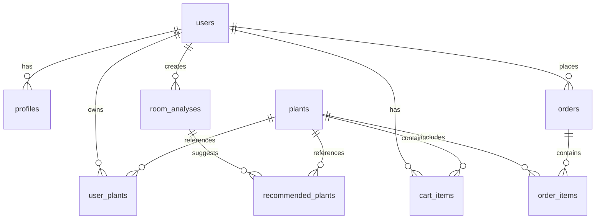

# チケット #11: データベーススキーマ作成

**タスクID**: BE-002  
**担当**: Backend  
**推定時間**: 3時間  
**依存関係**: [BE-001: Supabase設定]  
**優先度**: 高（Phase 1）

## 概要
Supabaseデータベースのテーブル設計とマイグレーション実行。

## TODO リスト

- [x] テーブル設計書作成（本ドキュメント）
- [x] マイグレーションファイル作成（supabase/migrations/20250829_000003_schema_update.sql）
- [x] インデックス設定（同上に反映）
- [x] RLS（Row Level Security）ポリシー設定（同上に反映）
- [x] 初期データ投入（supabase/seed.sql：開発用）
- [ ] バックアップ設定（Supabase側の自動バックアップ有効化）

## データベース設計

### ER図


## テーブル定義

### 1. profiles（ユーザープロファイル）

⚠️ **セキュリティ設計の重要事項**:
- `email`はSupabase Auth側で管理され、認証済みユーザーのみアクセス可能
- `profiles`テーブルからは`email`フィールドを削除し、必要時は`auth.users`からJOINで取得
- 個人情報は最小限に留め、RLSポリシーで厳格に保護

```sql
CREATE TABLE public.profiles (
  id UUID REFERENCES auth.users(id) PRIMARY KEY,
  -- emailフィールドは削除（auth.usersで管理）
  name TEXT,
  avatar_url TEXT,
  is_premium BOOLEAN DEFAULT false,
  premium_expires_at TIMESTAMP WITH TIME ZONE,
  plants_count INTEGER DEFAULT 0,
  ai_analysis_count INTEGER DEFAULT 0,
  ai_generation_count INTEGER DEFAULT 0,
  ai_consult_count INTEGER DEFAULT 0,
  notification_time TEXT DEFAULT '09:00',
  ai_last_reset_month SMALLINT, -- 月次リセット運用（サーバー側で管理）
  onboarding_completed BOOLEAN DEFAULT false,
  preferences JSONB DEFAULT '{}',
  created_at TIMESTAMP WITH TIME ZONE DEFAULT NOW(),
  updated_at TIMESTAMP WITH TIME ZONE DEFAULT NOW()
);

-- インデックス
-- emailインデックスは削除（auth.users側で管理）
CREATE INDEX idx_profiles_is_premium ON public.profiles(is_premium);
```

### 2. plants（植物マスター）
```sql
CREATE TABLE public.plants (
  id UUID DEFAULT gen_random_uuid() PRIMARY KEY,
  name TEXT NOT NULL,
  scientific_name TEXT,
  name_en TEXT,
  price INTEGER NOT NULL,
  original_price INTEGER,
  size TEXT CHECK (size IN ('S', 'M', 'L')) NOT NULL,
  difficulty TEXT CHECK (difficulty IN ('初心者向け', '中級者向け', '上級者向け')) NOT NULL,
  light_requirement TEXT NOT NULL,
  water_frequency TEXT NOT NULL,
  description TEXT,
  care_instructions TEXT,
  image_url TEXT,
  thumbnail_url TEXT,
  gallery_urls TEXT[],
  category TEXT,
  tags TEXT[],
  purchase_links JSONB DEFAULT '[]', -- 外部購入リンク（[{"vendor":"amazon","url":"..."}] など）
  stock INTEGER DEFAULT 0,
  is_available BOOLEAN DEFAULT true,
  popularity_score INTEGER DEFAULT 0,
  created_at TIMESTAMP WITH TIME ZONE DEFAULT NOW(),
  updated_at TIMESTAMP WITH TIME ZONE DEFAULT NOW()
);

-- インデックス
CREATE INDEX idx_plants_category ON public.plants(category);
CREATE INDEX idx_plants_size ON public.plants(size);
CREATE INDEX idx_plants_difficulty ON public.plants(difficulty);
CREATE INDEX idx_plants_price ON public.plants(price);
CREATE INDEX idx_plants_is_available ON public.plants(is_available);
-- フルテキスト検索用
CREATE INDEX idx_plants_search ON public.plants 
  USING gin(to_tsvector('japanese', name || ' ' || COALESCE(description, '')));

注: 日本語形態素解析の設定はPostgreSQLの辞書に依存します。必要に応じて管理画面/拡張で調整してください。
```

### 3. user_plants（ユーザーの植物）
```sql
CREATE TABLE public.user_plants (
  id UUID DEFAULT gen_random_uuid() PRIMARY KEY,
  user_id UUID REFERENCES auth.users(id) ON DELETE CASCADE NOT NULL,
  plant_id UUID REFERENCES public.plants(id),
  nickname TEXT,
  location TEXT DEFAULT 'リビング',
  last_watered TIMESTAMP WITH TIME ZONE,
  next_water_date DATE,
  water_frequency_days INTEGER DEFAULT 7,
  health_status TEXT CHECK (health_status IN ('healthy', 'warning', 'danger')) DEFAULT 'healthy',
  growth_stage TEXT CHECK (growth_stage IN ('seedling', 'young', 'mature')) DEFAULT 'young',
  notes TEXT,
  image_url TEXT,
  purchase_date DATE DEFAULT CURRENT_DATE,
  purchase_price INTEGER,
  is_favorite BOOLEAN DEFAULT false,
  created_at TIMESTAMP WITH TIME ZONE DEFAULT NOW(),
  updated_at TIMESTAMP WITH TIME ZONE DEFAULT NOW()
);

-- インデックス
CREATE INDEX idx_user_plants_user_id ON public.user_plants(user_id);
CREATE INDEX idx_user_plants_health_status ON public.user_plants(health_status);
CREATE INDEX idx_user_plants_next_water_date ON public.user_plants(next_water_date);
```

### 4. room_analyses（部屋分析）
```sql
CREATE TABLE public.room_analyses (
  id UUID DEFAULT gen_random_uuid() PRIMARY KEY,
  user_id UUID REFERENCES auth.users(id) ON DELETE CASCADE NOT NULL,
  image_url TEXT NOT NULL,
  thumbnail_url TEXT,
  analysis_result JSONB NOT NULL,
  light_level TEXT,
  humidity_level TEXT,
  temperature_range TEXT,
  room_size TEXT,
  style_preference TEXT,
  ai_prompt TEXT,
  ai_response TEXT,
  is_successful BOOLEAN DEFAULT true,
  created_at TIMESTAMP WITH TIME ZONE DEFAULT NOW()
);

-- インデックス
CREATE INDEX idx_room_analyses_user_id ON public.room_analyses(user_id);
CREATE INDEX idx_room_analyses_created_at ON public.room_analyses(created_at DESC);
```

### 5. ar_generations（配置画像生成履歴）
```sql
CREATE TABLE public.ar_generations (
  id UUID DEFAULT gen_random_uuid() PRIMARY KEY,
  user_id UUID REFERENCES auth.users(id) ON DELETE CASCADE NOT NULL,
  room_image_url TEXT NOT NULL,
  generated_image_url TEXT NOT NULL,
  plants UUID[] DEFAULT '{}',
  style TEXT CHECK (style IN ('natural','modern','minimal')),
  prompt TEXT,
  is_successful BOOLEAN DEFAULT true,
  created_at TIMESTAMP WITH TIME ZONE DEFAULT NOW()
);

CREATE INDEX idx_ar_generations_user_id ON public.ar_generations(user_id);
CREATE INDEX idx_ar_generations_created_at ON public.ar_generations(created_at DESC);
```

### 6. recommended_plants（推奨植物）
```sql
CREATE TABLE public.recommended_plants (
  id UUID DEFAULT gen_random_uuid() PRIMARY KEY,
  analysis_id UUID REFERENCES public.room_analyses(id) ON DELETE CASCADE NOT NULL,
  plant_id UUID REFERENCES public.plants(id) NOT NULL,
  recommendation_score DECIMAL(3,2) CHECK (recommendation_score >= 0 AND recommendation_score <= 1),
  reason TEXT,
  placement_suggestion TEXT,
  created_at TIMESTAMP WITH TIME ZONE DEFAULT NOW()
);

-- インデックス
CREATE INDEX idx_recommended_plants_analysis_id ON public.recommended_plants(analysis_id);
CREATE INDEX idx_recommended_plants_score ON public.recommended_plants(recommendation_score DESC);
```

### 7. purchase_items（購入リスト：検討/購入済み）
```sql
CREATE TABLE public.purchase_items (
  id UUID DEFAULT gen_random_uuid() PRIMARY KEY,
  user_id UUID REFERENCES auth.users(id) ON DELETE CASCADE NOT NULL,
  plant_id UUID REFERENCES public.plants(id) NOT NULL,
  status TEXT CHECK (status IN ('considering','purchased')) DEFAULT 'considering',
  external_url TEXT, -- 実購入に使った外部リンクの記録（任意）
  notes TEXT,
  purchased_at TIMESTAMP WITH TIME ZONE,
  created_at TIMESTAMP WITH TIME ZONE DEFAULT NOW(),
  updated_at TIMESTAMP WITH TIME ZONE DEFAULT NOW(),
  UNIQUE(user_id, plant_id)
);

CREATE INDEX idx_purchase_items_user_id ON public.purchase_items(user_id);
CREATE INDEX idx_purchase_items_status ON public.purchase_items(status);
```

### 8-9. （将来拡張）cart_items / orders / order_items
本MVPではアプリ内決済は行わないため、従来の`cart_items`/`orders`/`order_items`は将来拡張として保留する。
必要になった時点で決済フロー/ガイドラインを満たす形で再設計する。
```sql
CREATE TABLE public.cart_items (
  id UUID DEFAULT gen_random_uuid() PRIMARY KEY,
  user_id UUID REFERENCES auth.users(id) ON DELETE CASCADE NOT NULL,
  plant_id UUID REFERENCES public.plants(id) NOT NULL,
  quantity INTEGER DEFAULT 1 CHECK (quantity > 0),
  added_at TIMESTAMP WITH TIME ZONE DEFAULT NOW(),
  UNIQUE(user_id, plant_id)
);

-- インデックス
CREATE INDEX idx_cart_items_user_id ON public.cart_items(user_id);
```

### 8. orders（注文）
```sql
CREATE TABLE public.orders (
  id UUID DEFAULT gen_random_uuid() PRIMARY KEY,
  user_id UUID REFERENCES auth.users(id) ON DELETE CASCADE NOT NULL,
  order_number TEXT UNIQUE NOT NULL,
  status TEXT CHECK (status IN ('pending', 'processing', 'shipped', 'delivered', 'cancelled')) DEFAULT 'pending',
  total_amount INTEGER NOT NULL,
  subtotal INTEGER NOT NULL,
  tax_amount INTEGER DEFAULT 0,
  shipping_fee INTEGER DEFAULT 0,
  discount_amount INTEGER DEFAULT 0,
  payment_method TEXT,
  payment_status TEXT CHECK (payment_status IN ('pending', 'completed', 'failed', 'refunded')) DEFAULT 'pending',
  shipping_address JSONB,
  billing_address JSONB,
  notes TEXT,
  shipped_at TIMESTAMP WITH TIME ZONE,
  delivered_at TIMESTAMP WITH TIME ZONE,
  created_at TIMESTAMP WITH TIME ZONE DEFAULT NOW(),
  updated_at TIMESTAMP WITH TIME ZONE DEFAULT NOW()
);

-- インデックス
CREATE INDEX idx_orders_user_id ON public.orders(user_id);
CREATE INDEX idx_orders_status ON public.orders(status);
CREATE INDEX idx_orders_order_number ON public.orders(order_number);
CREATE INDEX idx_orders_created_at ON public.orders(created_at DESC);
```

### 9. order_items（注文明細）
```sql
CREATE TABLE public.order_items (
  id UUID DEFAULT gen_random_uuid() PRIMARY KEY,
  order_id UUID REFERENCES public.orders(id) ON DELETE CASCADE NOT NULL,
  plant_id UUID REFERENCES public.plants(id) NOT NULL,
  quantity INTEGER NOT NULL CHECK (quantity > 0),
  price INTEGER NOT NULL,
  subtotal INTEGER NOT NULL,
  created_at TIMESTAMP WITH TIME ZONE DEFAULT NOW()
);

-- インデックス
CREATE INDEX idx_order_items_order_id ON public.order_items(order_id);
```

### 10. watering_logs（水やりログ）
```sql
CREATE TABLE public.watering_logs (
  id UUID DEFAULT gen_random_uuid() PRIMARY KEY,
  user_plant_id UUID REFERENCES public.user_plants(id) ON DELETE CASCADE NOT NULL,
  watered_at TIMESTAMP WITH TIME ZONE DEFAULT NOW(),
  amount TEXT,
  notes TEXT,
  created_at TIMESTAMP WITH TIME ZONE DEFAULT NOW()
);

-- インデックス
CREATE INDEX idx_watering_logs_user_plant_id ON public.watering_logs(user_plant_id);
CREATE INDEX idx_watering_logs_watered_at ON public.watering_logs(watered_at DESC);
```

### 11. scheduled_notifications（通知スケジュール）
```sql
CREATE TABLE public.scheduled_notifications (
  id UUID DEFAULT gen_random_uuid() PRIMARY KEY,
  user_id UUID REFERENCES auth.users(id) ON DELETE CASCADE NOT NULL,
  type TEXT CHECK (type IN ('watering','new_feature','campaign')) NOT NULL,
  target_id UUID,
  scheduled_for TIMESTAMP WITH TIME ZONE NOT NULL,
  title TEXT,
  message TEXT,
  data JSONB DEFAULT '{}',
  status TEXT CHECK (status IN ('pending','sent','cancelled')) DEFAULT 'pending',
  onesignal_id TEXT,
  created_at TIMESTAMP WITH TIME ZONE DEFAULT NOW(),
  updated_at TIMESTAMP WITH TIME ZONE DEFAULT NOW(),
  UNIQUE(user_id, type, target_id, scheduled_for)
);

CREATE INDEX idx_sched_notif_user ON public.scheduled_notifications(user_id);
CREATE INDEX idx_sched_notif_status ON public.scheduled_notifications(status);
```

### 12. rate_limit_log（レート制限ログ）
```sql
CREATE TABLE public.rate_limit_log (
  id UUID DEFAULT gen_random_uuid() PRIMARY KEY,
  user_id UUID REFERENCES auth.users(id) ON DELETE CASCADE,
  action TEXT NOT NULL,
  created_at TIMESTAMP WITH TIME ZONE DEFAULT NOW()
);

CREATE INDEX idx_rate_limit_user_action ON public.rate_limit_log(user_id, action);
CREATE INDEX idx_rate_limit_created_at ON public.rate_limit_log(created_at DESC);
```

## トリガー関数

### updated_at自動更新
```sql
CREATE OR REPLACE FUNCTION update_updated_at_column()
RETURNS TRIGGER AS $$
BEGIN
  NEW.updated_at = NOW();
  RETURN NEW;
END;
$$ language 'plpgsql';

-- 各テーブルにトリガー適用
CREATE TRIGGER update_profiles_updated_at BEFORE UPDATE ON public.profiles
  FOR EACH ROW EXECUTE FUNCTION update_updated_at_column();

CREATE TRIGGER update_plants_updated_at BEFORE UPDATE ON public.plants
  FOR EACH ROW EXECUTE FUNCTION update_updated_at_column();

CREATE TRIGGER update_user_plants_updated_at BEFORE UPDATE ON public.user_plants
  FOR EACH ROW EXECUTE FUNCTION update_updated_at_column();

CREATE TRIGGER update_orders_updated_at BEFORE UPDATE ON public.orders
  FOR EACH ROW EXECUTE FUNCTION update_updated_at_column();
```

### 植物数カウント更新
```sql
CREATE OR REPLACE FUNCTION update_plants_count()
RETURNS TRIGGER AS $$
BEGIN
  IF TG_OP = 'INSERT' THEN
    UPDATE public.profiles 
    SET plants_count = plants_count + 1 
    WHERE id = NEW.user_id;
  ELSIF TG_OP = 'DELETE' THEN
    UPDATE public.profiles 
    SET plants_count = plants_count - 1 
    WHERE id = OLD.user_id;
  END IF;
  RETURN NULL;
END;
$$ LANGUAGE plpgsql;

CREATE TRIGGER update_user_plants_count
AFTER INSERT OR DELETE ON public.user_plants
FOR EACH ROW EXECUTE FUNCTION update_plants_count();
```

## RLSポリシー

### 🔒 セキュリティ優先設計
1. **個人情報の分離**: 
   - メールアドレスなどの機密情報は`auth.users`で管理
   - `profiles`にはアプリ固有データのみ保存

2. **アクセス制御の原則**:
   - デフォルトで全アクセス拒否
   - 必要最小限の権限のみ許可
   - サービス管理者のみがアクセス可能なテーブルを明確化

3. **Edge Functions経由のアクセス**:
   - 機密データ操作は必ずEdge Functions経由
   - Direct DB accessは最小限に

```sql
-- 全テーブルでRLS有効化
ALTER TABLE public.profiles ENABLE ROW LEVEL SECURITY;
ALTER TABLE public.user_plants ENABLE ROW LEVEL SECURITY;
ALTER TABLE public.room_analyses ENABLE ROW LEVEL SECURITY;
ALTER TABLE public.recommended_plants ENABLE ROW LEVEL SECURITY;
ALTER TABLE public.cart_items ENABLE ROW LEVEL SECURITY;
ALTER TABLE public.orders ENABLE ROW LEVEL SECURITY;
ALTER TABLE public.order_items ENABLE ROW LEVEL SECURITY;
ALTER TABLE public.watering_logs ENABLE ROW LEVEL SECURITY;
ALTER TABLE public.purchase_items ENABLE ROW LEVEL SECURITY;

-- profilesポリシー（厳格化）
CREATE POLICY "Users can view own profile" ON public.profiles
  FOR SELECT USING (auth.uid() = id);

CREATE POLICY "Users can update own profile" ON public.profiles
  FOR UPDATE USING (auth.uid() = id)
  WITH CHECK (
    -- emailやIDなど重要フィールドの変更を防ぐ
    id = auth.uid() AND
    -- is_premiumなどの課金フィールドは直接変更不可
    is_premium = (SELECT is_premium FROM public.profiles WHERE id = auth.uid())
  );

-- INSERTはauth.trigger経由のみ（ユーザー作成時）
-- DELETEは不許可（論理削除を推奨）

-- user_plantsポリシー
CREATE POLICY "Users can manage own plants" ON public.user_plants
  FOR ALL USING (auth.uid() = user_id);

-- plantsは誰でも閲覧可能
CREATE POLICY "Anyone can view plants" ON public.plants
  FOR SELECT USING (true);

-- purchase_itemsポリシー
CREATE POLICY "Users can manage own purchase list" ON public.purchase_items
  FOR ALL USING (auth.uid() = user_id);
```

## 初期データ投入

```sql
-- 植物マスターデータ
INSERT INTO public.plants (name, price, size, difficulty, light_requirement, water_frequency, description, category, stock)
VALUES
  ('モンステラ', 3980, 'M', '初心者向け', '明るい日陰', '週1-2回', '大きな切れ込みの入った葉が特徴的。育てやすく人気。', 'natural', 10),
  ('サンスベリア', 2980, 'S', '初心者向け', '日陰OK', '月2-3回', '空気清浄効果が高く、水やりが少なくて済む。', 'modern', 15),
  ('ポトス', 1980, 'S', '初心者向け', '日陰OK', '週1回', 'つる性で成長が早く、水栽培も可能。', 'cozy', 20),
  ('パキラ', 4980, 'L', '初心者向け', '明るい日陰', '週1回', '別名「発財樹」。縁起が良いとされる観葉植物。', 'natural', 8),
  ('フィカス・ウンベラータ', 5980, 'L', '中級者向け', '明るい日陰', '週1-2回', 'ハート型の大きな葉が特徴。インテリア性が高い。', 'nordic', 5);
```

## 完了条件
- [ ] 全テーブル作成完了
- [ ] インデックス設定完了
- [ ] RLSポリシー設定完了
- [ ] トリガー設定完了
- [ ] 初期データ投入完了
- [ ] マイグレーションテスト完了

## セキュリティ実装ガイド

### 1. ユーザー情報の取得パターン

```typescript
// ❌ 避けるべき実装: profilesテーブルから直接email取得
const { data } = await supabase
  .from('profiles')
  .select('email, name')  // emailはprofilesに存在しない

// ✅ 推奨実装: auth.users経由でemail取得
const { data: { user } } = await supabase.auth.getUser()
const email = user?.email  // 認証済みユーザーのみアクセス可能

// ✅ サーバーサイド（Edge Functions）での実装
const { data } = await supabaseAdmin
  .from('profiles')
  .select(`
    id,
    name,
    users:auth.users!inner(email)
  `)
  .eq('id', userId)
```

### 2. Edge Functions でのアクセス制御

```typescript
// Service Roleキーを使用（管理者権限）
const supabaseAdmin = createClient(
  process.env.SUPABASE_URL!,
  process.env.SUPABASE_SERVICE_ROLE_KEY!,  // RLSをバイパス
  {
    auth: {
      autoRefreshToken: false,
      persistSession: false
    }
  }
)

// ユーザー認証の確認
const authHeader = req.headers.get('Authorization')
if (!authHeader) throw new Error('Not authenticated')

const token = authHeader.replace('Bearer ', '')
const { data: { user } } = await supabaseAdmin.auth.getUser(token)
if (!user) throw new Error('Invalid token')
```

### 3. 機密データの管理原則

| データ種別 | 保存場所 | アクセス方法 | 備考 |
|-----------|----------|-------------|------|
| email | auth.users | auth.getUser() | Supabase Auth管理 |
| password | auth.users | 不可（ハッシュ化） | 自動管理 |
| 決済情報 | 外部サービス | Edge Functions経由 | RevenueCat等 |
| 個人識別番号 | 保存しない | - | GDPR/個人情報保護 |
| アプリ設定 | profiles | RLS制御 | ユーザー自身のみ |

## 備考
- 日本語対応のフルテキスト検索実装
- パフォーマンス考慮したインデックス設計
- 将来の拡張性を考慮した設計
- **セキュリティファースト**: 個人情報は最小限、アクセスは厳格に制御
- 月次使用制限（分析/生成/相談）は`profiles.ai_*_count`で管理し、月初にサーバー側でリセット（ジョブ/関数）

## 関連ファイル
- `supabase/migrations/` - マイグレーションファイル
- `supabase/seed.sql` - 初期データ

最終更新: 2025-08-28
（運用更新: GitHub Actions から自動適用対応 2025-08-29）

## 運用（自動マイグレーション）

- GitHub Secrets（設定済み想定）
  - `SUPABASE_ACCESS_TOKEN`
  - `SUPABASE_PROJECT_REF`
  - `SUPABASE_DB_PASSWORD`
- Workflow: `.github/workflows/supabase-migrations.yml`
  - `push`（`main`かつ`supabase/migrations/**`変更）で `supabase db push`
  - `workflow_dispatch` で手動実行可能
  - 手動実行手順: GitHub Actions → Supabase DB Migrations → Run workflow → main を選択

## バックアップ設定（TODO）
- Supabase Dashboard → Database → Backups で自動バックアップを有効化
- 重要テーブルのエクスポート/復旧手順を `docs/backup_restore.md` にまとめる（未作成）

## Auto-PR（Claude用）

目的:
- DBスキーマ（本ファイルのDDL）をマイグレーションとして追加しPRを作成

ブランチ:
- feat/<TICKET-ID>-db-schema

コミット規約:
- [<TICKET-ID>] で始める

動作確認（最低限）:
- [ ] マイグレーション適用成功
- [ ] 参照整合性/RLS確認

実行手順（Claude）:
```bash
git switch -c feat/<TICKET-ID>-db-schema
git add -A && git commit -m "[<TICKET-ID}] add db migrations"
git push -u origin feat/<TICKET-ID>-db-schema
gh pr create --fill --base main --head feat/<TICKET-ID>-db-schema
```
