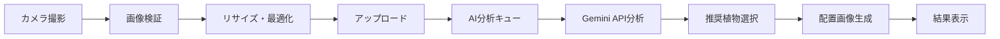

# チケット #18: 画像処理パイプライン統合

**タスクID**: INT-003  
**担当**: Full-stack  
**推定時間**: 4時間  
**依存関係**: [BE-005: 部屋API, BE-006: 画像アップロード, FE-003: カメラ画面]  
**優先度**: 中（Phase 2）

## 概要
カメラ撮影 → 画像アップロード → AI分析 → AR生成の一連のパイプラインを統合。

## TODO リスト

- [ ] 画像処理フロー設計
- [ ] プログレス表示実装
- [ ] エラーリカバリ機構
- [ ] キューシステム実装
- [ ] バッチ処理対応
- [ ] パフォーマンス最適化

## 画像処理フロー

### 全体フロー


## 統合サービス実装

### ImagePipelineService
```typescript
// src/services/imagePipeline.ts
import { supabase } from '../lib/supabase';
import { imageUploadService } from './imageUpload';
import { aiAnalysisService } from './aiAnalysis';
import { arGenerationService } from './arGeneration';

export interface PipelineOptions {
  onProgress?: (stage: string, progress: number) => void;
  onError?: (stage: string, error: Error) => void;
  generateAR?: boolean;
  selectedPlants?: Plant[];
  style?: 'natural' | 'modern' | 'minimal';
}

export interface PipelineResult {
  uploadedImageUrl: string;
  thumbnailUrl?: string;
  analysis?: RoomAnalysis;
  recommendations?: Plant[];
  arImageUrl?: string;
}

export class ImagePipelineService {
  private stages = [
    'validation',
    'optimization',
    'upload',
    'analysis',
    'recommendation',
    'ar_generation',
  ];

  async processRoomImage(
    imageUri: string,
    options: PipelineOptions = {}
  ): Promise<PipelineResult> {
    const result: PipelineResult = {
      uploadedImageUrl: '',
    };

    try {
      // Stage 1: 画像検証
      this.updateProgress('validation', 0, options.onProgress);
      await this.validateImage(imageUri);
      this.updateProgress('validation', 100, options.onProgress);

      // Stage 2: 画像最適化
      this.updateProgress('optimization', 0, options.onProgress);
      const optimizedImage = await this.optimizeImage(imageUri);
      this.updateProgress('optimization', 100, options.onProgress);

      // Stage 3: アップロード
      this.updateProgress('upload', 0, options.onProgress);
      const uploadResult = await this.uploadImage(optimizedImage);
      result.uploadedImageUrl = uploadResult.url;
      result.thumbnailUrl = uploadResult.thumbnailUrl;
      this.updateProgress('upload', 100, options.onProgress);

      // Stage 4: AI分析
      this.updateProgress('analysis', 0, options.onProgress);
      const analysisResult = await this.analyzeRoom(result.uploadedImageUrl);
      result.analysis = analysisResult.analysis;
      this.updateProgress('analysis', 100, options.onProgress);

      // Stage 5: 推奨植物取得
      this.updateProgress('recommendation', 0, options.onProgress);
      const recommendations = await this.getRecommendations(analysisResult.analysis);
      result.recommendations = recommendations;
      this.updateProgress('recommendation', 100, options.onProgress);

      // Stage 6: 配置画像生成（オプション）
      if (options.generateAR && options.selectedPlants) {
        this.updateProgress('ar_generation', 0, options.onProgress);
        const arImage = await this.generateARImage({
          roomImageUrl: result.uploadedImageUrl,
          plants: options.selectedPlants,
          style: options.style || 'natural',
        });
        result.arImageUrl = arImage.url;
        this.updateProgress('ar_generation', 100, options.onProgress);
      }

      return result;
    } catch (error) {
      // エラーハンドリング
      const stage = this.getCurrentStage(result);
      if (options.onError) {
        options.onError(stage, error as Error);
      }
      
      // リトライ可能なエラーの場合
      if (this.isRetryableError(error)) {
        return this.retryPipeline(imageUri, options, stage);
      }
      
      throw error;
    }
  }

  private async validateImage(imageUri: string): Promise<void> {
    // 画像フォーマット/サイズチェック（RN/Expo前提）
    const res = await fetch(imageUri);
    const blob = await res.blob();
    if (!blob.type.startsWith('image/')) throw new Error('Invalid image format');
    if (blob.size > 10 * 1024 * 1024) throw new Error('Image size exceeds 10MB limit');

    // 解像度チェック（Expo ImageManipulatorを利用）
    const ImageManipulator = require('expo-image-manipulator');
    // 一度メタ取得のために圧縮なしの情報を得る（RNでは幅/高さ取得APIが限定的）
    const tmp = await ImageManipulator.manipulateAsync(imageUri, [], { compress: 1, format: ImageManipulator.SaveFormat.JPEG });
    if (!tmp?.width || !tmp?.height || tmp.width < 640 || tmp.height < 480) {
      throw new Error('Image resolution too low (minimum 640x480)');
    }
  }

  private async optimizeImage(imageUri: string): Promise<Blob> {
    // Expo/React Native前提でImageManipulatorに統一
    const ImageManipulator = require('expo-image-manipulator');
    const result = await ImageManipulator.manipulateAsync(
      imageUri,
      [{ resize: { width: 1920 } }],
      { compress: 0.8, format: ImageManipulator.SaveFormat.JPEG }
    );
    const response = await fetch(result.uri);
    return response.blob();
  }

  // Web用の最適化は別ドキュメントで扱う（本MVPはExpoモバイル前提）

  private async uploadImage(imageBlob: Blob): Promise<{
    url: string;
    thumbnailUrl?: string;
  }> {
    const formData = new FormData();
    formData.append('file', imageBlob);
    formData.append('type', 'room');
    formData.append('thumbnail', 'true');

    const response = await fetch('/functions/v1/upload-image', {
      method: 'POST',
      headers: {
        'Authorization': `Bearer ${await this.getAuthToken()}`,
      },
      body: formData,
    });

    if (!response.ok) {
      throw new Error('Image upload failed');
    }

    const result = await response.json();
    return {
      url: result.data.url,
      thumbnailUrl: result.data.thumbnail_url,
    };
  }

  private async analyzeRoom(imageUrl: string): Promise<{
    analysis: RoomAnalysis;
  }> {
    const response = await fetch('/functions/v1/analyze-room', {
      method: 'POST',
      headers: {
        'Authorization': `Bearer ${await this.getAuthToken()}`,
        'Content-Type': 'application/json',
      },
      body: JSON.stringify({ image_url: imageUrl }),
    });

    if (!response.ok) {
      throw new Error('Room analysis failed');
    }

    const result = await response.json();
    return {
      analysis: result.data.analysis,
    };
  }

  private async getRecommendations(analysis: RoomAnalysis): Promise<Plant[]> {
    const response = await fetch('/functions/v1/get-recommended-plants', {
      method: 'POST',
      headers: {
        'Authorization': `Bearer ${await this.getAuthToken()}`,
        'Content-Type': 'application/json',
      },
      body: JSON.stringify({ room_analysis: analysis }),
    });

    if (!response.ok) {
      throw new Error('Failed to get recommendations');
    }

    const result = await response.json();
    return result.data;
  }

  private async generateARImage(params: {
    roomImageUrl: string;
    plants: Plant[];
    style: string;
  }): Promise<{ url: string }> {
    const response = await fetch('/functions/v1/generate-ar-image', {
      method: 'POST',
      headers: {
        'Authorization': `Bearer ${await this.getAuthToken()}`,
        'Content-Type': 'application/json',
      },
      body: JSON.stringify({
        room_image_url: params.roomImageUrl,
        plants: params.plants,
        style: params.style,
        placement_guide: this.getPlacementGuide(params.style),
      }),
    });

    if (!response.ok) {
      throw new Error('配置画像生成に失敗しました');
    }

    const result = await response.json();
    return { url: result.data.image_url };
  }

  private getPlacementGuide(style: string): string {
    const guides = {
      natural: 'ナチュラルで温かみのある配置',
      modern: 'モダンでスタイリッシュな配置',
      minimal: 'ミニマルで洗練された配置',
    };
    return guides[style] || guides.natural;
  }

  private updateProgress(
    stage: string,
    progress: number,
    onProgress?: (stage: string, progress: number) => void
  ): void {
    if (onProgress) {
      onProgress(stage, progress);
    }
  }

  private getCurrentStage(result: PipelineResult): string {
    if (!result.uploadedImageUrl) return 'upload';
    if (!result.analysis) return 'analysis';
    if (!result.recommendations) return 'recommendation';
    if (!result.arImageUrl) return 'ar_generation';
    return 'complete';
  }

  private isRetryableError(error: any): boolean {
    // ネットワークエラーやタイムアウトはリトライ可能
    return error.code === 'NETWORK_ERROR' || 
           error.code === 'TIMEOUT' ||
           error.message?.includes('fetch failed');
  }

  private async retryPipeline(
    imageUri: string,
    options: PipelineOptions,
    fromStage: string
  ): Promise<PipelineResult> {
    // 3回までリトライ
    const maxRetries = 3;
    let retryCount = 0;
    
    while (retryCount < maxRetries) {
      try {
        await new Promise(resolve => setTimeout(resolve, 1000 * (retryCount + 1)));
        return await this.processRoomImage(imageUri, options);
      } catch (error) {
        retryCount++;
        if (retryCount >= maxRetries) {
          throw error;
        }
      }
    }
    
    throw new Error('Pipeline failed after retries');
  }

  private async getAuthToken(): Promise<string> {
    const { data: { session } } = await supabase.auth.getSession();
    if (!session) throw new Error('Not authenticated');
    return session.access_token;
  }
}

export const imagePipelineService = new ImagePipelineService();
```

## プログレス表示UI

```typescript
// src/components/PipelineProgress.tsx
import React from 'react';
import { View, Text, StyleSheet } from 'react-native';
import { LinearProgress } from '@rneui/themed';

interface PipelineProgressProps {
  stage: string;
  progress: number;
}

const stageLabels = {
  validation: '画像を確認中...',
  optimization: '画像を最適化中...',
  upload: 'アップロード中...',
  analysis: 'AI分析中...',
  recommendation: 'おすすめを選定中...',
  ar_generation: '配置画像を生成中...',
};

export const PipelineProgress: React.FC<PipelineProgressProps> = ({
  stage,
  progress,
}) => {
  return (
    <View style={styles.container}>
      <Text style={styles.label}>{stageLabels[stage] || '処理中...'}</Text>
      <LinearProgress
        value={progress / 100}
        variant="determinate"
        color="#48BB78"
        trackColor="#E2E8F0"
        style={styles.progress}
      />
      <Text style={styles.percentage}>{progress}%</Text>
    </View>
  );
};

const styles = StyleSheet.create({
  container: {
    padding: 20,
    backgroundColor: '#FFFFFF',
    borderRadius: 12,
    marginVertical: 10,
  },
  label: {
    fontSize: 16,
    color: '#2D3748',
    marginBottom: 10,
  },
  progress: {
    height: 8,
    borderRadius: 4,
  },
  percentage: {
    fontSize: 14,
    color: '#718096',
    marginTop: 8,
    textAlign: 'right',
  },
});
```

## 使用例

```typescript
// src/screens/CameraResultScreen.tsx
import { imagePipelineService } from '../services/imagePipeline';

const CameraResultScreen = ({ route, navigation }) => {
  const { imageUri } = route.params;
  const [stage, setStage] = useState('validation');
  const [progress, setProgress] = useState(0);
  const [result, setResult] = useState(null);
  const [error, setError] = useState(null);

  useEffect(() => {
    processImage();
  }, []);

  const processImage = async () => {
    try {
      const pipelineResult = await imagePipelineService.processRoomImage(
        imageUri,
        {
          onProgress: (stage, progress) => {
            setStage(stage);
            setProgress(progress);
          },
          onError: (stage, error) => {
            console.error(`Error at ${stage}:`, error);
            setError({ stage, message: error.message });
          },
          generateAR: false, // 初回はAR生成しない
        }
      );

      setResult(pipelineResult);
      navigation.navigate('Recommendations', {
        analysis: pipelineResult.analysis,
        recommendations: pipelineResult.recommendations,
        roomImageUrl: pipelineResult.uploadedImageUrl,
      });
    } catch (err) {
      setError({ stage, message: err.message });
    }
  };

  if (error) {
    return <ErrorScreen error={error} onRetry={processImage} />;
  }

  return (
    <View style={styles.container}>
      <Text style={styles.title}>画像を処理中</Text>
      <PipelineProgress stage={stage} progress={progress} />
      <Text style={styles.hint}>
        しばらくお待ちください...
      </Text>
    </View>
  );
};
```

## 完了条件
- [ ] パイプラインサービス実装
- [ ] プログレス表示実装
- [ ] エラーリカバリ実装
- [ ] リトライ機構実装
- [ ] パフォーマンス最適化
- [ ] テスト実装

## 備考
- 各ステージは独立して失敗可能
- 失敗したステージから再開可能
- ネットワーク状況に応じて自動リトライ

## 関連ファイル
- `src/services/imagePipeline.ts` - パイプラインサービス
- `src/components/PipelineProgress.tsx` - プログレス表示
- `src/screens/CameraResultScreen.tsx` - 結果画面

最終更新: 2025-08-28
